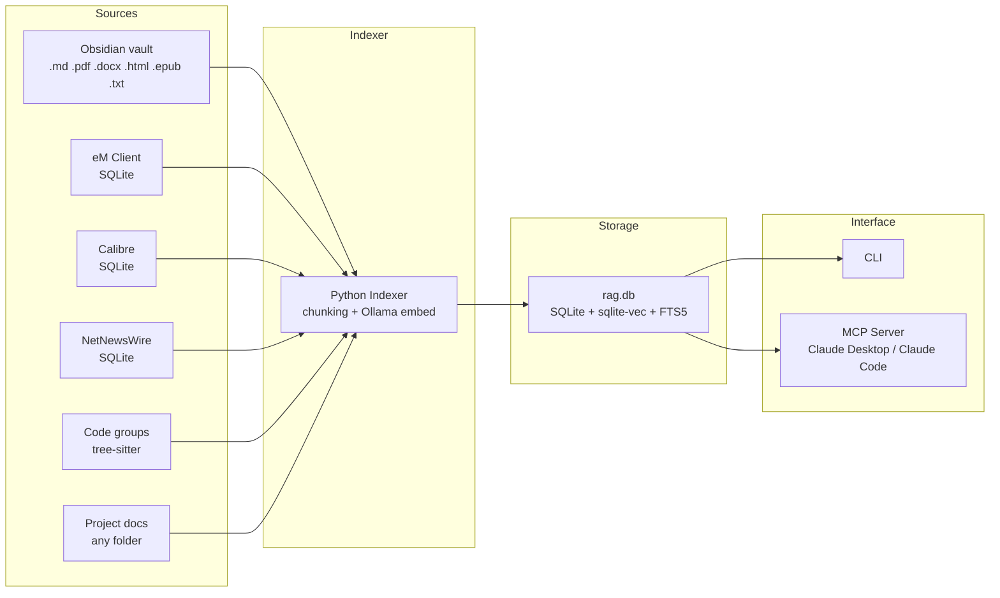

# CLAUDE.md

## Project: local-rag

A fully local, privacy-preserving RAG (Retrieval Augmented Generation) system for macOS. Indexes personal knowledge from multiple sources into a single SQLite database with vector + full-text hybrid search. Exposes search via CLI and an MCP server so Claude Desktop and Claude Code can query it directly.

---

## Quick Start

```bash
# Prerequisites
brew install ollama uv
ollama pull bge-m3

# Setup (uv automatically manages the venv)
cd /path/to/local-rag

# Index sources (uv run auto-creates and manages venv)
uv run local-rag index obsidian
uv run local-rag index email
uv run local-rag index calibre
uv run local-rag index rss
uv run local-rag index group rustyquill
uv run local-rag index group                    # all groups
uv run local-rag index project "Project Alpha" ~/Documents/project-alpha-docs/

# Search
uv run local-rag search "kubernetes deployment strategy"
uv run local-rag search "invoice from supplier" --collection email
uv run local-rag search "API specification" --collection "Project Alpha"

# Run MCP server (for Claude Desktop / Claude Code integration)
uv run local-rag serve
```

---

## Architecture



### Core Concepts

**Collections**: Every indexed source belongs to a collection. System collections ("obsidian", "email", "calibre", "rss") have dedicated parsers. Code groups are collections of type "code" that contain one or more git repos grouped by org or topic. Project folders create project-type collections. Search can target a specific collection or search across all of them.

**Hybrid search**: Every query runs both vector similarity search (semantic) and FTS5 full-text search (keyword). Results are merged using Reciprocal Rank Fusion (RRF). This ensures that both "what does this mean" and "find the exact phrase" queries work well.

**Incremental indexing**: Track file hashes, modification times, and watermarks. Only re-embed changed or new content. Use `--force` to re-index everything.

---

## Supported Sources

| Source | Collection | CLI Command | Data Source |
|--------|------------|-------------|-------------|
| **Obsidian** | `obsidian` | `index obsidian` | Vault directory — all file types (.md, .pdf, .docx, .html, .txt, .epub) |
| **eM Client** | `email` | `index email` | SQLite databases (read-only) — subject, body, sender, recipients, date, folder |
| **Calibre** | `calibre` | `index calibre` | SQLite metadata.db + book files (read-only) — EPUB/PDF content with author, tags, series metadata |
| **NetNewsWire** | `rss` | `index rss` | SQLite databases (read-only) — RSS article title, author, content, feed name |
| **Code Groups** | group name | `index group [NAME]` | Git repos grouped by org/topic — tree-sitter structural parsing, respects .gitignore |
| **Project Docs** | user name | `index project NAME PATH` | Any folder — files dispatched to correct parser by extension |

---

## Tech Stack

| Component      | Choice                     | Notes                                |
|----------------|----------------------------|--------------------------------------|
| Language       | Python 3.13+               |                                      |
| Database       | SQLite + sqlite-vec + FTS5 | Single file, no server               |
| Embeddings     | Ollama + bge-m3 (1024d)    | Fully local, no API keys             |
| PDF parsing    | pymupdf (fitz)             | Best quality for PDF text extraction |
| EPUB parsing   | zipfile + BeautifulSoup    | Chapter-based extraction             |
| DOCX parsing   | python-docx                | Read Word documents                  |
| Code parsing   | tree-sitter                | Structural parsing for 11 languages  |
| HTML to text   | beautifulsoup4             | Strip HTML from email/RSS bodies     |
| CLI            | click                      |                                      |
| MCP server     | mcp (Python SDK)           | Exposes tools to Claude              |

---

## Database Schema

The database lives at `~/.local-rag/rag.db` by default (configurable).

```sql
-- Collections: namespaces for organizing indexed content
-- System collections: 'obsidian', 'email', 'calibre', 'rss'
-- User collections: any name, used for project-based grouping
CREATE TABLE collections (
    id INTEGER PRIMARY KEY AUTOINCREMENT,
    name TEXT NOT NULL UNIQUE,
    collection_type TEXT NOT NULL DEFAULT 'project',  -- 'system' or 'project'
    description TEXT,
    created_at TEXT DEFAULT (datetime('now'))
);

-- Sources: individual files or email accounts that have been indexed
CREATE TABLE sources (
    id INTEGER PRIMARY KEY AUTOINCREMENT,
    collection_id INTEGER NOT NULL REFERENCES collections(id) ON DELETE CASCADE,
    source_type TEXT NOT NULL,           -- 'markdown', 'email', 'pdf', 'docx', 'txt', 'html', 'epub', 'code', 'rss'
    source_path TEXT NOT NULL,           -- file path or email message ID
    file_hash TEXT,                      -- SHA256 of file content for change detection
    file_modified_at TEXT,               -- filesystem mtime
    last_indexed_at TEXT,
    UNIQUE(collection_id, source_path)
);

-- Documents: chunked content with metadata
CREATE TABLE documents (
    id INTEGER PRIMARY KEY AUTOINCREMENT,
    source_id INTEGER NOT NULL REFERENCES sources(id) ON DELETE CASCADE,
    collection_id INTEGER NOT NULL REFERENCES collections(id) ON DELETE CASCADE,
    chunk_index INTEGER NOT NULL,
    title TEXT,                           -- note title, email subject, PDF filename
    content TEXT NOT NULL,                -- the text chunk
    metadata TEXT,                        -- JSON: tags, sender, dates, heading path, page number, etc.
    created_at TEXT DEFAULT (datetime('now')),
    UNIQUE(source_id, chunk_index)
);

-- Vector index (sqlite-vec virtual table)
CREATE VIRTUAL TABLE vec_documents USING vec0(
    embedding float[1024],
    document_id INTEGER
);

-- Full-text search index (FTS5)
CREATE VIRTUAL TABLE documents_fts USING fts5(
    title,
    content,
    content='documents',
    content_rowid='id'
);

-- Triggers to keep FTS in sync with documents table
CREATE TRIGGER documents_ai AFTER INSERT ON documents BEGIN
    INSERT INTO documents_fts(rowid, title, content) VALUES (new.id, new.title, new.content);
END;
CREATE TRIGGER documents_ad AFTER DELETE ON documents BEGIN
    INSERT INTO documents_fts(documents_fts, rowid, title, content) VALUES('delete', old.id, old.title, old.content);
END;
CREATE TRIGGER documents_au AFTER UPDATE ON documents BEGIN
    INSERT INTO documents_fts(documents_fts, rowid, title, content) VALUES('delete', old.id, old.title, old.content);
    INSERT INTO documents_fts(rowid, title, content) VALUES (new.id, new.title, new.content);
END;
```

---

## File Structure

```
local-rag/
├── CLAUDE.md                        # This file
├── pyproject.toml                   # Package config, dependencies, CLI entry point
├── README.md
├── config.example.json              # Example configuration
├── docs/
│   ├── architecture.md              # System architecture overview
│   ├── emclient-schema.md           # eM Client SQLite schema documentation
│   ├── hybrid-search-and-rrf.md     # How hybrid search and RRF work
│   └── ollama-and-embeddings.md     # Ollama setup and embedding models
├── src/
│   └── local_rag/
│       ├── __init__.py
│       ├── cli.py                   # Click CLI entry point
│       ├── config.py                # Load/validate config
│       ├── db.py                    # Database init, connection, migrations
│       ├── embeddings.py            # Ollama embedding helpers
│       ├── chunker.py               # Text chunking strategies (per file type)
│       ├── search.py                # Hybrid search engine (vector + FTS + RRF)
│       ├── parsers/
│       │   ├── __init__.py
│       │   ├── markdown.py          # Obsidian .md parser (frontmatter, wikilinks, tags)
│       │   ├── email.py             # eM Client SQLite reader + email parser
│       │   ├── pdf.py               # PDF text extraction (pymupdf)
│       │   ├── docx.py              # DOCX text extraction (python-docx)
│       │   ├── epub.py              # EPUB text extraction (zipfile + BeautifulSoup)
│       │   ├── html.py              # HTML to text (beautifulsoup4)
│       │   ├── plaintext.py         # .txt passthrough
│       │   ├── calibre.py           # Calibre metadata.db parser
│       │   ├── rss.py               # NetNewsWire RSS article parser
│       │   └── code.py              # Tree-sitter code parser (11 languages)
│       ├── indexers/
│       │   ├── __init__.py
│       │   ├── base.py              # Abstract base indexer
│       │   ├── obsidian.py          # Obsidian vault indexer (all file types)
│       │   ├── email_indexer.py     # eM Client email indexer
│       │   ├── calibre_indexer.py   # Calibre ebook indexer
│       │   ├── rss_indexer.py       # NetNewsWire RSS indexer
│       │   ├── git_indexer.py       # Git repository indexer
│       │   └── project.py           # Project document indexer
│       └── mcp_server.py            # MCP server exposing search + index tools
├── scripts/
│   └── explore_emclient.py          # One-off: discover eM Client SQLite schema
└── tests/
    ├── test_chunker.py
    ├── test_search.py
    ├── test_parsers.py
    └── fixtures/                    # Sample .md, .pdf, .docx files for tests
```

---

## CLI Commands

```bash
# Indexing
local-rag index obsidian [--vault PATH]...       # Index Obsidian vaults (from config or args)
local-rag index email                             # Index eM Client emails
local-rag index calibre [--library PATH]...       # Index Calibre ebook libraries
local-rag index rss                               # Index NetNewsWire RSS articles
local-rag index group [NAME]                      # Index code group(s) from config
local-rag index project "Name" PATH [PATH]...     # Index docs into a named project
local-rag index all                               # Index all configured sources at once

# All index commands support --force to re-index everything

# Searching
local-rag search "query text"                     # Search all collections
local-rag search "query" --collection obsidian    # Search specific collection
local-rag search "query" --collection "Project A" # Search a project
local-rag search "query" --type pdf               # Filter by source type
local-rag search "query" --from "sender@mail.com" # Filter by email sender
local-rag search "query" --author "Author Name"   # Filter by book author
local-rag search "query" --after 2025-01-01       # Filter by date
local-rag search "query" --top 20                 # Number of results

# Collection management
local-rag collections list                        # List all collections with source/chunk counts
local-rag collections info "Project A"            # Show details of a collection
local-rag collections delete "Project A"          # Delete a project collection and all its data

# Status
local-rag status                                  # Overall stats: collections, doc counts, DB size, last index times

# MCP server
local-rag serve                                   # Start MCP server (stdio transport)
local-rag serve --port 8080                       # Start with HTTP/SSE transport
```

---

## Configuration

Config file location: `~/.local-rag/config.json`

```json
{
  "db_path": "~/.local-rag/rag.db",
  "embedding_model": "bge-m3",
  "embedding_dimensions": 1024,
  "chunk_size_tokens": 500,
  "chunk_overlap_tokens": 50,
  "obsidian_vaults": [
    "~/Documents/MyVault"
  ],
  "obsidian_exclude_folders": [
    "_Inbox",
    "_Templates"
  ],
  "emclient_db_path": "~/Library/Application Support/eM Client",
  "calibre_libraries": [
    "~/CalibreLibrary"
  ],
  "netnewswire_db_path": "~/Library/Containers/com.ranchero.NetNewsWire-Evergreen/Data/Library/Application Support/NetNewsWire/Accounts",
  "code_groups": {
    "my-org": ["~/Repository/my-org/repo1", "~/Repository/my-org/repo2"],
    "terraform": ["~/Repository/my-org/tf-infra", "~/Repository/other-org/tf-modules"]
  },
  "disabled_collections": [],
  "search_defaults": {
    "top_k": 10,
    "rrf_k": 60,
    "vector_weight": 0.7,
    "fts_weight": 0.3
  }
}
```

---

## MCP Server Registration

For **Claude Code**, add to the project's `.mcp.json`:
```json
{
  "mcpServers": {
    "local-rag": {
      "command": "uv",
      "args": ["run", "--directory", "/path/to/local-rag", "local-rag", "serve"],
      "env": {}
    }
  }
}
```

For **Claude Desktop**, add to `~/Library/Application Support/Claude/claude_desktop_config.json`:
```json
{
  "mcpServers": {
    "local-rag": {
      "command": "uv",
      "args": ["run", "--directory", "/path/to/local-rag", "local-rag", "serve"],
      "env": {}
    }
  }
}
```

---

## Key Constraints & Rules

- **Everything runs locally.** No cloud APIs, no API keys, no data leaves the machine.
- **Embedding model must be configurable.** Default to `bge-m3` (1024) but support switching to `mxbai-embed-large` (1024d) or others. If the model changes, all existing embeddings must be regenerated (warn the user).
- **Incremental indexing by default.** Use file hashes (SHA256) for document files, message IDs for email, and watermarks for date-based sources. Provide `--force` flag to re-index everything.
- **Collection isolation.** Collections are independent. Deleting a collection removes all its sources, documents, and embeddings cleanly (CASCADE).
- **Graceful error handling.** If Ollama is not running, print a clear error. If a PDF has no extractable text, warn and skip. Never crash mid-index — log errors and continue.
- **Search always returns source attribution.** Every result includes the collection name, source file path, and chunk context so the user can trace back to the original document.
- **Read-only access to external databases.** eM Client, Calibre, and NetNewsWire databases are always opened in SQLite read-only mode to prevent accidental writes.
- **Collections can be disabled.** Add collection names to `disabled_collections` in config to stop indexing without deleting existing data. Works with any collection name: system collections (`obsidian`, `email`, `calibre`, `rss`) or user-created ones (code group names, project names).

---

## Coding Standards

- Type hints on all function signatures
- Dataclasses for structured data (Chunk, SearchResult, CollectionInfo, etc.)
- Docstrings on public functions
- No global state — pass db connections and config explicitly
- Use `logging` module, not print statements
- Tests for parsers and search logic (chunker edge cases, RRF merging, etc.)

---

## References

- sqlite-vec: https://github.com/asg017/sqlite-vec
- Ollama embedding docs: https://ollama.com/blog/embedding-models
- MCP Python SDK: https://github.com/modelcontextprotocol/python-sdk
- MCP specification: https://modelcontextprotocol.io
- eM Client forensic schema analysis: https://github.com/SecurityAura/Aura-Research/blob/main/DFIR/BEC/eM%20Client/eMClient.md
