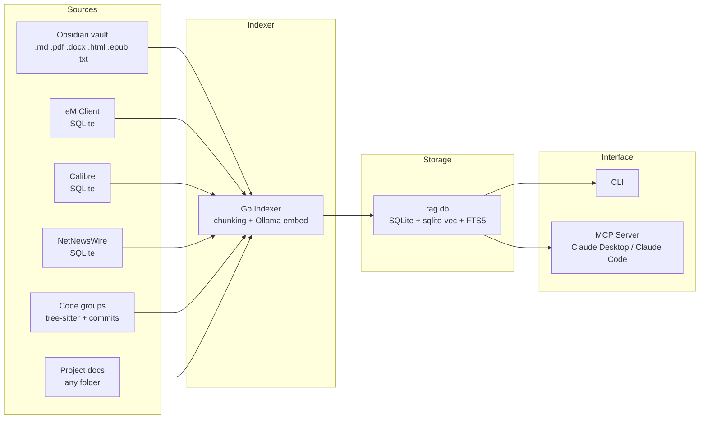

# CLAUDE.md

## Project: local-rag

A fully local, privacy-preserving RAG (Retrieval Augmented Generation) system for macOS. Indexes personal knowledge from multiple sources into a single SQLite database with vector + full-text hybrid search. Exposes search via CLI and an MCP server so Claude Desktop and Claude Code can query it directly.

---

## Quick Start

```bash
# Prerequisites
brew install ollama go
ollama pull bge-m3

# Optional: OCR support for scanned PDFs
brew install tesseract tesseract-lang

# Build
git clone https://github.com/sebastianhutter/local-rag.git
cd local-rag
make build            # binary at bin/local-rag

# Index sources
local-rag index obsidian
local-rag index email
local-rag index calibre
local-rag index rss
local-rag index group rustyquill
local-rag index group                    # all groups
local-rag index group rustyquill --history  # code + commit history
local-rag index project "Project Alpha" ~/Documents/project-alpha-docs/

# Search
local-rag search "kubernetes deployment strategy"
local-rag search "invoice from supplier" --collection email
local-rag search "API specification" --collection "Project Alpha"

# Run MCP server (for Claude Desktop / Claude Code integration)
local-rag serve
```

---

## Architecture


```mermaid
flowchart LR
    subgraph Sources
        OBS["Obsidian vault<br/>.md .pdf .docx .html .epub .txt"]
        EM["eM Client<br/>SQLite"]
        CAL["Calibre<br/>SQLite"]
        NNW["NetNewsWire<br/>SQLite"]
        GIT["Code groups<br/>tree-sitter + commits"]
        PRJ["Project docs<br/>any folder"]
    end

    subgraph Indexer
        IDX["Go Indexer<br/>chunking + Ollama embed"]
    end

    subgraph Storage
        DB["rag.db<br/>SQLite + sqlite-vec + FTS5"]
    end

    subgraph Interface
        CLI["CLI"]
        MCP["MCP Server<br/>Claude Desktop / Claude Code"]
    end

    OBS --> IDX
    EM --> IDX
    CAL --> IDX
    NNW --> IDX
    GIT --> IDX
    PRJ --> IDX
    IDX --> DB
    DB --> CLI
    DB --> MCP
```

### Core Concepts

**Collections**: Every indexed source belongs to a collection. System collections ("obsidian", "email", "calibre", "rss") have dedicated parsers. Code groups are collections of type "code" that contain one or more git repos grouped by org or topic. Project folders create project-type collections. Search can target a specific collection or search across all of them.

**Hybrid search**: Every query runs both vector similarity search (semantic) and FTS5 full-text search (keyword). Results are merged using Reciprocal Rank Fusion (RRF). This ensures that both "what does this mean" and "find the exact phrase" queries work well.

**Incremental indexing**: Track file hashes, modification times, and watermarks. Only re-embed changed or new content. Use `--force` to re-index everything.

---

## Supported Sources

| Source | Collection | CLI Command | Data Source |
|--------|------------|-------------|-------------|
| **Obsidian** | `obsidian` | `index obsidian` | Vault directory — all file types (.md, .pdf, .docx, .html, .txt, .epub) |
| **eM Client** | `email` | `index email` | SQLite databases (read-only) — subject, body, sender, recipients, date, folder |
| **Calibre** | `calibre` | `index calibre` | SQLite metadata.db + book files (read-only) — EPUB/PDF content with author, tags, series metadata |
| **NetNewsWire** | `rss` | `index rss` | SQLite databases (read-only) — RSS article title, author, content, feed name |
| **Code Groups** | group name | `index group [NAME]` | Git repos grouped by org/topic — tree-sitter structural parsing + commit history (messages and per-file diffs), respects .gitignore |
| **Project Docs** | user name | `index project NAME PATH` | Any folder — files dispatched to correct parser by extension |

---

## Tech Stack

| Component    | Choice                     | Notes                                  |
|--------------|----------------------------|----------------------------------------|
| Language     | Go 1.24+                   | CGO required for SQLite                |
| Database     | SQLite + sqlite-vec + FTS5 | Single file, no server                 |
| Embeddings   | Ollama + bge-m3 (1024d)    | Fully local, no API keys               |
| GUI          | Fyne v2 + systray          | macOS menu bar app                     |
| MCP          | mcp-go                     | SSE and stdio transports               |
| PDF          | go-pdfium (WASM/Wazero)    | No CGO needed for PDF                  |
| PDF OCR      | tesseract (optional)       | Fallback for scanned/image-only PDFs   |
| DOCX         | lu4p/cat                   | Word document extraction               |
| Code parsing | go-tree-sitter             | 13 languages with structural splitting |
| CLI          | Cobra                      | Subcommands, flags, help               |
| HTML cleanup | golang.org/x/net/html      | Strip tags from email/RSS              |

---

## Database Schema

The database lives at `~/.local-rag/rag.db` by default (configurable).

```sql
-- Collections: namespaces for organizing indexed content
-- System collections: 'obsidian', 'email', 'calibre', 'rss'
-- User collections: any name, used for project-based grouping
CREATE TABLE collections (
    id INTEGER PRIMARY KEY AUTOINCREMENT,
    name TEXT NOT NULL UNIQUE,
    collection_type TEXT NOT NULL DEFAULT 'project',  -- 'system', 'project', or 'code'
    description TEXT,
    paths TEXT,                               -- JSON array of source paths (used by project collections)
    created_at TEXT DEFAULT (datetime('now'))
);

-- Sources: individual files or email accounts that have been indexed
CREATE TABLE sources (
    id INTEGER PRIMARY KEY AUTOINCREMENT,
    collection_id INTEGER NOT NULL REFERENCES collections(id) ON DELETE CASCADE,
    source_type TEXT NOT NULL,           -- 'markdown', 'email', 'pdf', 'docx', 'txt', 'html', 'epub', 'code', 'rss'
    source_path TEXT NOT NULL,           -- file path or email message ID
    file_hash TEXT,                      -- SHA256 of file content for change detection
    file_modified_at TEXT,               -- filesystem mtime
    last_indexed_at TEXT,
    UNIQUE(collection_id, source_path)
);

-- Documents: chunked content with metadata
CREATE TABLE documents (
    id INTEGER PRIMARY KEY AUTOINCREMENT,
    source_id INTEGER NOT NULL REFERENCES sources(id) ON DELETE CASCADE,
    collection_id INTEGER NOT NULL REFERENCES collections(id) ON DELETE CASCADE,
    chunk_index INTEGER NOT NULL,
    title TEXT,                           -- note title, email subject, PDF filename
    content TEXT NOT NULL,                -- the text chunk
    metadata TEXT,                        -- JSON: tags, sender, dates, heading path, page number, etc.
    created_at TEXT DEFAULT (datetime('now')),
    UNIQUE(source_id, chunk_index)
);

-- Vector index (sqlite-vec virtual table)
CREATE VIRTUAL TABLE vec_documents USING vec0(
    embedding float[1024],
    document_id INTEGER
);

-- Full-text search index (FTS5)
CREATE VIRTUAL TABLE documents_fts USING fts5(
    title,
    content,
    content='documents',
    content_rowid='id'
);

-- Triggers to keep FTS in sync with documents table
CREATE TRIGGER documents_ai AFTER INSERT ON documents BEGIN
    INSERT INTO documents_fts(rowid, title, content) VALUES (new.id, new.title, new.content);
END;
CREATE TRIGGER documents_ad AFTER DELETE ON documents BEGIN
    INSERT INTO documents_fts(documents_fts, rowid, title, content) VALUES('delete', old.id, old.title, old.content);
END;
CREATE TRIGGER documents_au AFTER UPDATE ON documents BEGIN
    INSERT INTO documents_fts(documents_fts, rowid, title, content) VALUES('delete', old.id, old.title, old.content);
    INSERT INTO documents_fts(rowid, title, content) VALUES (new.id, new.title, new.content);
END;
```

---

## File Structure

```
local-rag/
├── CLAUDE.md                        # This file
├── Makefile                         # Build targets (build, test, lint, app, dmg)
├── README.md
├── go.mod / go.sum                  # Go module dependencies
├── cmd/
│   └── local-rag/
│       └── main.go                  # Cobra CLI entry point
├── docs/
│   ├── architecture.md              # System architecture overview
│   ├── emclient-schema.md           # eM Client SQLite schema documentation
│   ├── hybrid-search-and-rrf.md     # How hybrid search and RRF work
│   └── ollama-and-embeddings.md     # Ollama setup and embedding models
├── internal/
│   ├── config/                      # Configuration loading and defaults
│   ├── db/                          # SQLite + sqlite-vec + FTS5 setup and migrations
│   ├── embeddings/                  # Ollama embedding client
│   ├── chunker/                     # Text chunking strategies (per file type)
│   ├── search/                      # Hybrid search engine (vector + FTS + RRF)
│   ├── parser/                      # File parsers (markdown, pdf, docx, epub, html, code, rss, email, calibre)
│   ├── indexer/                     # Source indexers (obsidian, email, calibre, rss, git, project)
│   ├── mcp/                         # MCP server (tools, SSE, stdio)
│   └── gui/                         # Fyne menu bar app, settings, log viewer
└── scripts/
    ├── build-app.sh                 # Create macOS .app bundle
    └── build-dmg.sh                 # Create DMG installer
```

---

## CLI Commands

```bash
# Indexing
local-rag index obsidian [--vault/-V PATH]...    # Index Obsidian vaults (from config or args)
local-rag index email                             # Index eM Client emails
local-rag index calibre [--library/-l PATH]...   # Index Calibre ebook libraries
local-rag index rss                               # Index NetNewsWire RSS articles
local-rag index group [NAME] [--history]          # Index code group(s), --history for commit history
local-rag index project NAME [PATH...]            # Index docs into a named project
local-rag index all                               # Index all configured sources at once

# All index commands support --force to re-index everything

# Searching
local-rag search "query text"                     # Search all collections
local-rag search "query" --collection obsidian    # Search specific collection
local-rag search "query" --collection "Project A" # Search a project
local-rag search "query" --type pdf               # Filter by source type
local-rag search "query" --from "sender@mail.com" # Filter by email sender
local-rag search "query" --meta source=jira        # Filter by metadata field
local-rag search "query" --meta source=confluence  # Jira/Confluence frontmatter
local-rag search "query" --author "Author Name"   # Filter by book author
local-rag search "query" --after 2025-01-01       # Filter by date
local-rag search "query" --meta source=jira       # Filter by metadata field
local-rag search "query" --meta issue_key=CB-123  # Filter by specific metadata value
local-rag search "query" --top 20                 # Number of results

# Collection management
local-rag collections list                       # List all collections with counts
local-rag collections info NAME                  # Show collection details
local-rag collections delete NAME [-y]           # Delete a collection and all its data
local-rag collections export NAME                # Export collection metadata as JSON
local-rag collections paths list NAME            # List stored paths for a collection
local-rag collections paths add NAME PATH...     # Add paths to a collection
local-rag collections paths remove NAME PATH...  # Remove paths from a collection
local-rag collections paths update NAME \        # Rewrite path prefixes in-place
  --old-prefix OLD --new-prefix NEW              # (collection paths + source paths)

# Status and GUI
local-rag status                        # Overall stats: collections, doc counts, DB size, Ollama status
local-rag gui                           # Start menu bar app (default when no subcommand)

# MCP server
local-rag serve                         # Start MCP server (stdio transport)
local-rag serve --port 31123            # Start with HTTP/SSE transport

# MCP tools support metadata_filter for arbitrary metadata filtering:
# rag_search with metadata_filter: {"source": "jira"} filters by frontmatter fields
```

---

## Configuration

Config file location: `~/.local-rag/config.json`

```json
{
  "db_path": "~/.local-rag/rag.db",
  "embedding_model": "bge-m3",
  "embedding_dimensions": 1024,
  "chunk_size_tokens": 500,
  "chunk_overlap_tokens": 50,
  "obsidian_vaults": [
    "~/Documents/MyVault"
  ],
  "obsidian_exclude_folders": [
    "_Inbox",
    "_Templates"
  ],
  "emclient_db_path": "~/Library/Application Support/eM Client",
  "calibre_libraries": [
    "~/CalibreLibrary"
  ],
  "netnewswire_db_path": "~/Library/Containers/com.ranchero.NetNewsWire-Evergreen/Data/Library/Application Support/NetNewsWire/Accounts",
  "code_groups": {
    "my-org": ["~/Repository/my-org/repo1", "~/Repository/my-org/repo2"],
    "terraform": ["~/Repository/my-org/tf-infra", "~/Repository/other-org/tf-modules"]
  },
  "disabled_collections": [],
  "git_history_in_months": 6,
  "git_commit_subject_blacklist": [
    "Automated show, episode and transcript sync"
  ],
  "search_defaults": {
    "top_k": 10,
    "rrf_k": 60,
    "vector_weight": 0.7,
    "fts_weight": 0.3
  },
  "ocr": {
    "enabled": false,
    "languages": ["eng"],
    "max_pages": 50,
    "max_file_size_mb": 100,
    "min_word_count": 10
  }
}
```

---

## MCP Server Registration

### GUI Mode (SSE) — recommended for Claude Code

When the menu bar app is running, its built-in MCP server uses SSE on `http://127.0.0.1:31123/sse`.

Add to the project's `.mcp.json`:
```json
{
  "mcpServers": {
    "local-rag": {
      "type": "sse",
      "url": "http://127.0.0.1:31123/sse"
    }
  }
}
```

### Standalone Mode (stdio) — for Claude Desktop

For **Claude Desktop**, add to `~/Library/Application Support/Claude/claude_desktop_config.json`:
```json
{
  "mcpServers": {
    "local-rag": {
      "command": "/path/to/local-rag",
      "args": ["serve"]
    }
  }
}
```

---

## Key Constraints & Rules

- **Everything runs locally.** No cloud APIs, no API keys, no data leaves the machine.
- **Embedding model must be configurable.** Default to `bge-m3` (1024) but support switching to `mxbai-embed-large` (1024d) or others. If the model changes, all existing embeddings must be regenerated (warn the user).
- **Incremental indexing by default.** Use file hashes (SHA256) for document files, message IDs for email, and watermarks for date-based sources. Provide `--force` flag to re-index everything.
- **Collection isolation.** Collections are independent. Deleting a collection removes all its sources, documents, and embeddings cleanly (CASCADE).
- **Graceful error handling.** If Ollama is not running, print a clear error. If a PDF has no extractable text, warn and skip. Never crash mid-index — log errors and continue.
- **Search always returns source attribution.** Every result includes the collection name, source file path, and chunk context so the user can trace back to the original document.
- **Read-only access to external databases.** eM Client, Calibre, and NetNewsWire databases are always opened in SQLite read-only mode to prevent accidental writes.
- **Collections can be disabled.** Add collection names to `disabled_collections` in config to stop indexing without deleting existing data. Works with any collection name: system collections (`obsidian`, `email`, `calibre`, `rss`) or user-created ones (code group names, project names).

---

## Coding Standards

- Exported types and functions have Go doc comments
- Structs for structured data (Chunk, SearchResult, etc.) — no untyped maps for public API
- Error values returned, not panics; wrap errors with `fmt.Errorf("...: %w", err)`
- No global state — pass `*sql.DB` and `*config.Config` explicitly through call stack
- Use `log/slog` for structured logging, not `fmt.Print`
- Build with `make build` and test with `make test` (both require `-tags sqlite_fts5`)
- Tests live in `_test.go` files alongside the code they test

---

## References

- sqlite-vec: https://github.com/asg017/sqlite-vec
- Ollama embedding docs: https://ollama.com/blog/embedding-models
- mcp-go: https://github.com/mark3labs/mcp-go
- MCP specification: https://modelcontextprotocol.io
- go-pdfium: https://github.com/klippa-app/go-pdfium
- go-tree-sitter: https://github.com/smacker/go-tree-sitter
- eM Client forensic schema analysis: https://github.com/SecurityAura/Aura-Research/blob/main/DFIR/BEC/eM%20Client/eMClient.md
