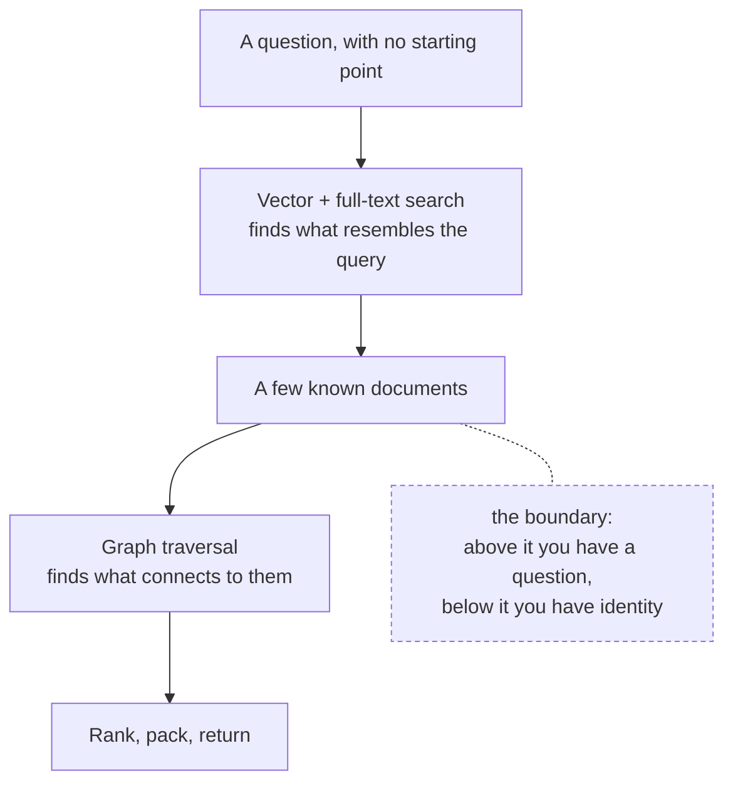
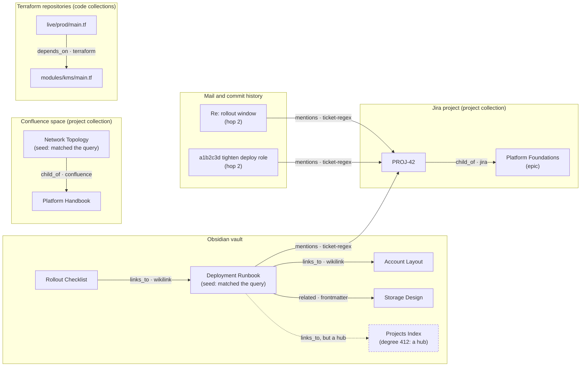

# The Relation Graph

This document explains why local-rag stores a graph alongside its vectors, what
goes into it, and how a traversal is kept from returning half the corpus. Every
number in it was measured on a real database of ~768,000 documents, replaying
389 searches taken from actual usage.

## The Gap Search Cannot Close

Hybrid search finds documents that *resemble* a query — semantically, lexically,
or both. See [hybrid-search-and-rrf.md](hybrid-search-and-rrf.md) for how that
works. It is the only thing that works when you have a question and no idea
where to start.

But resemblance is not relatedness. Consider a vault note that says:

> Restrict the deployment role to read-only for this guardrail.

and a second note that never mentions guardrails, roles or read-only at all — it
describes an account layout — but which the first note links to with
`[[Account Layout]]`.

Ask "how do we restrict the deployment role for a guardrail" and search finds
the first note. It cannot find the second, at any `top_k`, with any rewording,
however good the embedding model is: the two notes sit far apart in embedding
space and share no keywords. The relation exists only because a human wrote a
link.

That is a **structural** gap, not a ranking problem. Raising `top_k` returns more
near-misses; it does not return the linked note.

Measured over 60 queries replayed from real usage: **78% had at least one such
document — related to a good result, unreachable at `top_k` 60.**

## Where Vectors End and the Graph Begins

The two indexes answer different questions, and the handover is a single row:



- **Vectors work without a starting point.** That is their whole purpose. A graph
  cannot do this: traversal needs a node to start from.
- **The graph works without shared vocabulary.** Once you *have* a node, its edges
  hold regardless of wording. Vectors cannot do this.

So vectors are the door and the graph is the corridor. Neither replaces the
other, and the boundary exists whatever database you use.

## What Is a Node

A node is a **source** — one indexed file — not a document chunk. Two reasons:

1. A relation belongs to the file. A wikilink written in the third paragraph is a
   fact about the note, not about whichever 500-word window happened to contain
   it.
2. `sources.id` survives re-embedding; a `documents.id` does not. Keying edges on
   chunks would orphan the graph on every re-index.

There is no separate node table: `sources` already is one.

## What Is an Edge

```sql
CREATE TABLE graph_edges (
    src_source_id INTEGER NOT NULL REFERENCES sources(id) ON DELETE CASCADE,
    dst_source_id INTEGER NOT NULL REFERENCES sources(id) ON DELETE CASCADE,
    rel           TEXT NOT NULL,
    origin        TEXT NOT NULL,
    PRIMARY KEY (src_source_id, dst_source_id, rel)
);
```

Two labels, because they answer different questions:

- **`rel` — what does this relation mean?** `links_to`, `child_of`, `mentions`,
  `depends_on`, or a frontmatter property name such as `related` or `parent`. This is what a
  caller filters on when it wants a page's parent but not passing mentions.
- **`origin` — where did this edge come from?** `wikilink`, `frontmatter`,
  `confluence`, `jira`, `terraform`, `ticket-regex`. Each origin is rebuilt independently, so one
  class can be regenerated or discarded without touching the others.

That separation costs nothing today and matters later: a parsed wikilink and an
LLM-extracted relation have nothing in common in cost or error rate, and only the
second ever needs throwing away wholesale.

Unlike the `vec0` virtual tables, this one takes foreign keys — so pruning a
source or deleting a collection removes its edges automatically.

## The Five Origins

All five are **parsed, not inferred**. Nothing calls a model, so a rebuild is a
scan: about 2 seconds for the three metadata-only origins, and 20 seconds each
for the two that read content.

### `confluence` — page hierarchy

A synced Confluence page carries `page_id` and `parent_id` in its metadata. Both
ends are integers written by the sync tool, so nothing is resolved by name and
nothing is ambiguous. The most reliable edge available.

*1,749 edges.*

Roughly a third of pages that declare a parent point at one that was never
exported. Those are Confluence **folders** — a content type the pages endpoint
does not return — rather than a resolution failure at this end.

### `jira` — issue hierarchy

An issue's `parent_key` links a story to its epic, or a sub-task to its story.
Separate from `confluence` because `origin` says where an edge came from and the
two syncs are independent: a Jira re-sync rebuilds these without touching the
wiki tree. The relation is `child_of` for both, because `rel` says what an edge
*means* and a caller asking "what does this belong to" wants either.

Resolution is near-total — 60% of issues declare a parent and 99.7% of those
parents are indexed — which makes this the cleanest origin available after
`confluence`.

*4,344 edges, 13 unresolved.*

### `frontmatter` — typed relations a human wrote

A note recording `related: ["[[Other Note]]"]` or `parent: "[[Overview]]"` gets
an edge whose `rel` **is the property name**, so `parent` and `related` stay
distinguishable instead of collapsing into one undifferentiated link.

These are the most deliberate relations in a vault — someone typed them into a
named field — and they were being discarded entirely until the parser learned to
read them.

Only `[[bracketed]]` values count. Frontmatter holds arbitrary data — dates, page
ids, titles, tags — and reading a bare string as a link target invents relations
out of ordinary values: a `page_id` of `"1"` would resolve to a note called
`1.md`.

*252 edges, across `related`, `parent`, `author`, `baseline`.*

### `wikilink` — links in the body

Body `[[links]]`, minus any target a frontmatter property already claimed: the
parser merges frontmatter links into the same flat list, and they carry a better
relation name there.

Resolution is deliberately modest, and matches Obsidian's behaviour where it is
cheap to do so:

| Link form | Resolution |
|---|---|
| `[[Note]]` | file name, case-insensitive |
| `[[Folder/Note]]` | path match first, then path suffix |
| `[[Note#Heading]]` | heading stripped, note resolved |
| `[[#Heading]]`, `[[^block]]` | intra-note reference — not an edge |
| `[[image.png]]`, `[[spec.pdf]]` | attachment — not an edge |
| ambiguous name | shallowest path wins (Obsidian's rule), stably |

Aliases are **not** implemented, because the vault this was built against
contains none. Unresolved references are reported separately from skipped ones,
so the counts stay honest: of ~4,600 references, 1,152 are unresolved (mostly
links to notes in excluded folders, or notes that do not exist) and 1,034 are
skipped as not-a-note.

*2,395 edges.*

### `terraform` — module dependencies

A Terraform file's `source` argument links it to the module it calls, which
answers the two questions an infrastructure corpus is actually asked: *what
depends on this module*, and *what does this root module pull in*.

Three source forms resolve, for three different reasons:

| form | how it resolves | measured |
|---|---|---|
| `source = "../../modules/kms"` | arithmetic against the calling file | 702 of 841 (83%) |
| `source = "git::https://host/terraform/aws/modules/kms.git?ref=2.8.1"` | the URL contains the repository path, matched as a directory suffix | 2,499 of 2,510 (**100%**) |
| `source = "registry/kms/aws"` | only via `graph.terraform_registry_paths` | 1,462 of 1,673 (87%) |

A provider address in `required_providers` uses the same `source` keyword and is
not a module; a public registry module is not in the corpus. Both are counted as
skipped rather than unresolved, so the unresolved figure keeps meaning something.

**Why the registry form needs configuration.** A registry address shares only
the module *name* with a checkout, and names are generic: resolving by name
alone measured **37% unique and 58% ambiguous**, because `s3` matches nine
indexed directories and `backup` six. So a caller states where a given
registry's modules live. The value is a list, since one registry's modules span
repositories and a module can exist under two layouts at once during a
migration — of 61 names measured, 40 resolved in one path and 7 in two. Order is
precedence: first match wins. A `//subdir` selector survives, pointing at the
nested module rather than the parent.

An edge points at the module's **entry file** — `main.tf`, else the
alphabetically first `.tf` in the directory — because both endpoints have to be
sources and a directory is not one.

*4,363 edges, 208 unresolved, 1,962 skipped.*

### `ticket-regex` — mentions of an issue key

Any document naming a ticket is linked to that ticket's own record. This is the
**only origin that crosses corpora**: a mail, a commit message and a vault note
all reach the same Jira issue, and the whole mechanism is one regular expression
over content the database already holds.

Project prefixes are derived from the issues that are actually indexed, so a new
Jira project needs no code change. The scan is narrowed by `GLOB` inside SQLite,
so only candidate rows cross into Go.

*14,827 edges — by far the largest class.*

**Notification mail is excluded**, via `graph.mention_exclude_senders`. Tracker
mail names a ticket without referring to it: the mail exists *because* of the
ticket, so an edge between them is a tautology adding nothing the ticket's own
record holds. Worse, it wins traversal outright — ranking prefers a low-degree
neighbour as more specific, and nothing ever mentions a notification, so every
notification looks maximally specific. Before excluding two senders, expanding a
ticket returned five machine mails and no human reference; **8,812 of 23,639
candidate mention edges (37%) came from those two senders.**

## The Edges in Action

All five origins at once, on an invented corpus. A search has returned two
results — a vault note and a wiki page — and the traversal walks out from them:



Seven things in that picture are worth naming, because each is a decision taken
somewhere in this document:

1. **`Rollout Checklist` is returned even though the seed does not link to it.**
   It links *to* the seed. Traversal is undirected: "what is this connected to"
   wants inbound edges as much as outbound ones.
2. **`Storage Design` arrives as `related`, not as `links_to`.** The relation was
   written into a named frontmatter property, so the property name survives as
   the relation and the caller can ask for `related` alone.
3. **`Network Topology` reaches its parent, not its siblings.** `child_of` is
   followed like any other edge; the other children of `Platform Handbook` are
   two hops away, and at `hops: 1` they stay there.
4. **The mail and the commit are reached at hop 2, through the ticket.** Neither
   contains a word of the original query, and neither is in the same collection
   as either seed. This is the one relation that crosses corpora, and it is what
   a regular expression over an issue key buys.
5. **`PROJ-42` reaches its epic, and the epic is returned even if it has forty
   other children.** A parent is exempt from hub suppression and ranks as though
   nothing pointed at it — an epic's degree counts its children, which says
   nothing about how well it answers "what does this belong to".
6. **`live/prod/main.tf` depends on a module** by way of a `source` argument, so
   "what depends on this module" is a traversal rather than a grep.
7. **`Projects Index` is linked from the seed and is still not returned.** With
   412 edges it is a table of contents: as a route it would drag in half the
   vault, and as an answer it says nothing. `hub_cap` stops the traversal there
   and `IncludeHubs` overrides that for a caller who wants it.

Everything above is one hop from a seed except where marked, and the whole
result — titles, paths, relations, one-line snippets — costs about a fifth of a
second search.

## Traversal: Three Rules That Do All the Work

The naive version of "return what this is connected to" is unusable, and the
reason is worth stating precisely: **expansion cost is bounded by the degree of
the nodes it starts from, not by how many nodes exist.** A corpus of any size
always contains a few documents that enumerate hundreds of others.

Replaying the 60-query set, dropping these rules took the candidate set from 356
to 1,153 while adding folder-index notes and runs of twenty consecutive
sibling pages.

### 1. A hub is a destination, not a corridor

Expansion never passes *through* a node whose degree exceeds `hub_cap`
(default 25) — including a seed, since a document listing 570 ticket keys is a
hub whatever put it in the result set.

By default such a node is not returned either: a source with hundreds of edges is
a table of contents, not an answer. `IncludeHubs` restores it for a caller that
wants one.

**A parent is exempt.** An epic with forty stories has a degree of forty, but
"what does this belong to" is precisely the question worth answering, and the
answer is a single node rather than a fan-out. So a `child_of` neighbour is
returned whatever its degree, while expansion still refuses to travel *through*
it — which is what would drag in the forty siblings.

The highest-degree nodes in a real database are a document enumerating 570
tickets, a Confluence draft with 568, and a folder-index note with 482.

### 2. Rank by hops, then by ascending degree

Degree stands in for **specificity**. A source that two things point at says far
more than one four hundred things mention. Without that ordering, a traversal
surfaces the corpus's most generic documents first.

That reasoning inverts for a parent, whose degree merely counts its children, so
a `child_of` neighbour ranks as though nothing pointed at it. Without that it
would sort to the back and be cut by the per-seed cap — the exemption above
would be undone by the ranking.

### 3. Bound what any one seed contributes

`PerSeedLimit` (default 5) stops one prolific node monopolising the result: a
wiki page with thirty children would otherwise contribute thirty
siblings-by-proxy and bury what every other seed found. Candidates are ordered by
the destination's degree *before* the cap applies, so a seed spends its allowance
on its rarest neighbours.

Neighbours sharing a title are then collapsed, which is not cosmetic: one ticket
attracts dozens of near-identical machine mails, each at degree 1.

Traversal is undirected throughout. "What is this connected to" wants the edges
pointing *at* a source as much as the ones leaving it — a page's children are as
relevant as its parent.

## What a Traversal Returns, and Why It Is Cheap

Titles, paths, relations and **one-line snippets** — never full content. That is
the economic case for the whole feature:

| | tokens |
|---|---|
| one neighbour | ~120 |
| median expansion (7 neighbours) | ~820 |
| one `rag_search` call (median of 388 real calls) | ~3,500 |

Roughly four times cheaper than another search, and it reaches documents no
search can. Read the promising ones afterwards with a filtered search, or open
the file.

This matters more than it looks. In 2.5 months of real usage, **74% of searches
happened in bursts of three or more within four minutes** — the same question
reworded, because the agent had no way to say "show me what surrounds this".
1.55M tokens went to search results in that period.

## Usage

```bash
local-rag graph rebuild                      # all origins
local-rag graph rebuild --origin wikilink    # one class, others untouched
local-rag graph rebuild --origin terraform  # after adding a registry mapping
local-rag graph stats                        # counts by origin and relation, top hubs

local-rag neighbors "Storage Architecture"   # by path substring
local-rag neighbors 4711 --rel related --hops 2 --hub-cap 40 --top 10
```

The graph is rebuilt automatically after any `local-rag index …` run and after a
GUI index, since a graph derived from indexed content goes stale the moment that
content changes — silently, because a traversal keeps working and simply points
at things that moved. `--no-graph` skips it.

Agents reach the same traversal through the `rag_neighbors` MCP tool, taking the
`source_id` that `rag_search` returns with every result.

## What Is Deliberately Not Here

- **No LLM-extracted entities or relations, and no community summaries.** Nothing
  measured justifies the cost: they would need re-extracting over 768,000
  documents on every index, and every measured win so far came from edges that
  were already written down by a human or a tool.
- **No PageRank or centrality in ranking.** The degree distribution cannot support
  it — median degree 1 — and the highest-degree nodes are navigation pages, so a
  centrality boost would promote tables of contents.
- **No traversal beyond two hops.** Three hops over this corpus returns a
  substantial fraction of it.
- **No graph database.** SQLite with an edge table and a bounded walk handles this
  scale in milliseconds, in the same file as the vectors and the full-text index,
  so a single query can join retrieval and traversal.
